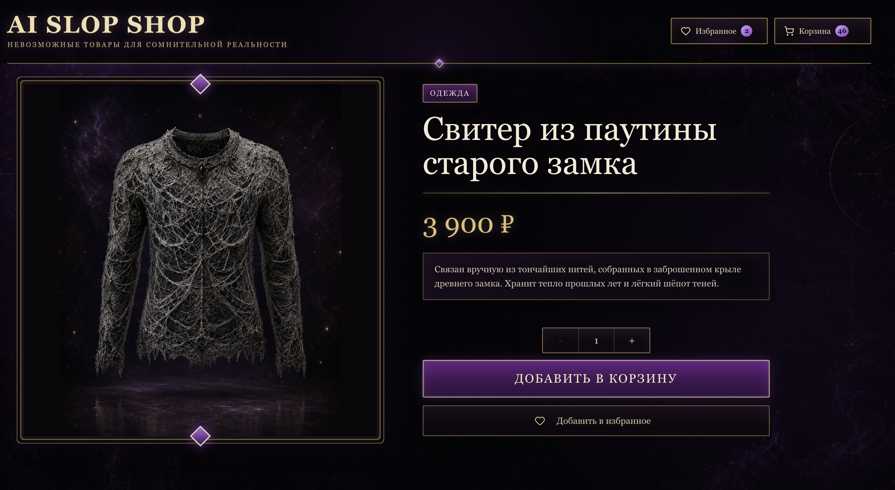
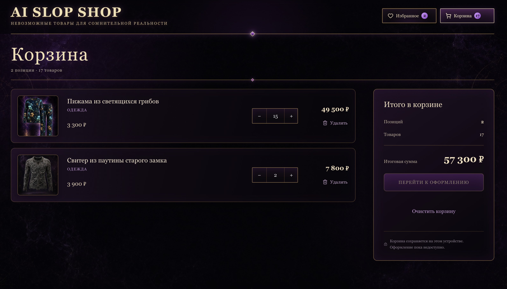

# AI Slop Shop

A compact storefront for impossible AI-generated goods, built with React, TypeScript, Next.js, and an InsForge backend. The project combines a searchable catalog with URL-backed filters, server-rendered product pages, a persistent cart, favorites, cross-tab synchronization, and original fantasy product imagery.

## Screenshots

### Product catalog


### Product page



### Cart



## Stack

- Next.js 16 App Router
- React 19
- TypeScript
- Tailwind CSS 4
- InsForge Database and TypeScript SDK
- Vercel
- Vitest and Testing Library

## Features

- Product catalog loaded from InsForge Database through a server-only Next.js Route Handler
- Product images served locally from `public/images/products`
- Debounced product search
- URL-backed product search, category filtering, and price/title sorting
- Responsive product grid
- Server-rendered product pages loaded from InsForge by slug
- Shared cart implemented with Context and `useReducer`
- Cart and favorites persistence in `localStorage`
- Cart and favorites synchronization between browser tabs
- Favorites implemented as an external store
- Loading, error, and empty states
- Abortable catalog requests with `AbortController`

## Routes

- `/` - product catalog
- `/products/[slug]` - product details
- `/cart` - persistent shopping cart
- `/favorites` - persistent favorites

## Backend

InsForge replaces the original public fake-store API and owns the catalog data. Product images are deployed with the application so they remain available without a direct browser connection to InsForge.

```text
InsForge Database
  categories
  products
```

Server code reads product data through `@insforge/sdk`. The catalog uses the `/api/products` Route Handler as a small Backend for Frontend layer, while individual product pages fetch one product by slug during server rendering. Database rows are mapped to the frontend `Product` model inside `src/entities/product/api`, so UI components do not depend directly on the backend schema.

Product records retain `image_key` and `image_url`, while the mapper converts known storage URLs into local paths such as `/images/products/example-v2.jpg`. A reusable product image component switches to a local placeholder if a file cannot be loaded.

## Production Data Flow

Direct browser requests to the InsForge domain timed out for users in Russia without a VPN. Moving only the images into `public` did not solve the catalog failure because the browser still needed InsForge Database to discover the products.

The catalog now uses a small Backend for Frontend layer:

```text
Browser → GET /api/products on Vercel → server-only InsForge SDK → InsForge Database
        ← JSON with local image paths ← mapped product rows ←
```

The browser talks only to the application origin for catalog data. The Route Handler converts upstream failures into a safe `502` response, and successful catalog responses are cached by the Vercel CDN for three days with one day of stale-while-revalidate.

This approach kept InsForge as the existing database instead of introducing a second PostgreSQL provider. The server uses only the anonymous key; database grants and RLS remain the security boundary, and public access is limited to `SELECT` on `categories` and `products`.

The result was verified on the production deployment without a VPN over desktop Wi-Fi, mobile Wi-Fi, and mobile internet. Browser Network showed requests to `/api/products`, no direct requests to `insforge.app`, and a Vercel CDN cache `HIT`.

## Hooks Practised

| Hook                   | Use in the project                                                                |
| ---------------------- | --------------------------------------------------------------------------------- |
| `useState`             | Search, category, sorting, loading, errors, and cart restoration status           |
| `useEffect`            | Product requests, debounce cleanup, autofocus, and `localStorage` synchronization |
| `useRef`               | Search input access and stable mutable values inside custom hooks                 |
| `useMemo`              | Derived categories and filtered/sorted products                                   |
| `useReducer`           | Cart add, remove, increase, decrease, clear, and hydrate actions                  |
| `useContext`           | Shared cart access through `CartProvider`                                         |
| `useId`                | Accessible relationships between labels and controls                              |
| `useImperativeHandle`  | Restricted search input API exposed to the header search slot                     |
| `useSyncExternalStore` | Favorites snapshots, subscriptions, SSR snapshot, and cross-tab updates           |

Additional experiments:

- `React.memo` was removed when memoization no longer improved rendering.
- `useDeferredValue` compared with debounce; debounce was retained for the intended search behavior.
- `useLayoutEffect` used for a DOM measurement exercise and removed because the final UI did not require synchronous layout measurement.

## State And Persistence

The cart and favorites intentionally use different state models:

- The cart is React-owned state managed by `useReducer` and distributed through Context. Effects restore and persist it in `localStorage`.
- Favorites use a small external store connected through `useSyncExternalStore`. The store exposes snapshots, subscriptions, actions, and a stable server snapshot.

Both features listen for the browser `storage` event so changes made in one tab appear in another tab on the same origin.

Persisted data uses the branded keys `ai-slop-shop:cart` and `ai-slop-shop:favorite-ids`.

## Architecture

The source tree follows an FSD-inspired separation of responsibilities:

```text
src/
  app/                       routes, layout, and providers
  entities/product/          product model, server repository, mapper, browser transport, and reusable UI
  features/cart/             cart model, context, and UI
  features/favorites/        external favorites store and favorite action
  features/products-catalog/ catalog request state, URL filters, derived data, and UI
  shared/api/                server-only configured InsForge client
```

Product entities do not import cart or favorites features. Route and feature-level components compose entity UI with feature actions through props and slots.

## Getting Started

Install dependencies:

```bash
npm install
```

Create `.env.local`:

```bash
INSFORGE_URL=https://your-project.insforge.app
INSFORGE_ANON_KEY=your-public-anon-key
```

These variables have no `NEXT_PUBLIC_` prefix and are available only to server code. The anon key is intentionally low-privilege; database permissions remain the actual security boundary. Never use an InsForge admin key in the application.

Start the development server:

```bash
npm run dev
```

Open [http://localhost:3000](http://localhost:3000).

Useful checks:

```bash
npm run test:run
npm run lint
npm run build
```

## Deployment

The application is deployed with Vercel. Add `INSFORGE_URL` and `INSFORGE_ANON_KEY` to the Vercel project environment before deploying.

## Tests

The project contains 11 focused tests across four suites:

- database-row mapping and category validation;
- browser transport success, HTTP errors, malformed data, and abort handling;
- Route Handler success and safe upstream failure responses;
- product image rendering and fallback behavior.

Next.js production compilation additionally verifies that the server-only modules do not leak into the client bundle.

## What I Learned

- How React state, reducers, Context, and external stores solve different ownership problems
- How immutable snapshots allow React to detect external store changes
- How SSR and hydration affect browser-only APIs such as `localStorage`
- How to persist state without replacing the existing cart architecture
- How Server and Client Components can be composed without turning an entire route into a Client Component
- How to map database rows into an application-owned entity model
- How to separate client transport, an HTTP Route Handler, server-rendered product reads, and a server-only repository
- How to keep an external database while proxying inaccessible browser traffic through Vercel
- How to test a mapper, browser fetch wrapper, Route Handler, and image fallback with Vitest

## Limitations And Next Steps

- Cart and favorites are browser-local and are not associated with an authenticated user.
- The `useOptimistic` favorites experiment was removed: updates only write to synchronous `localStorage`, so there is no remote request to hide and no failed request to roll back.
- Authentication and server-side user persistence are intentionally outside the current scope.
- The current suite covers critical units and integration boundaries; end-to-end browser tests are not included yet.
- Catalog cache invalidation is time-based rather than triggered immediately after database edits.
