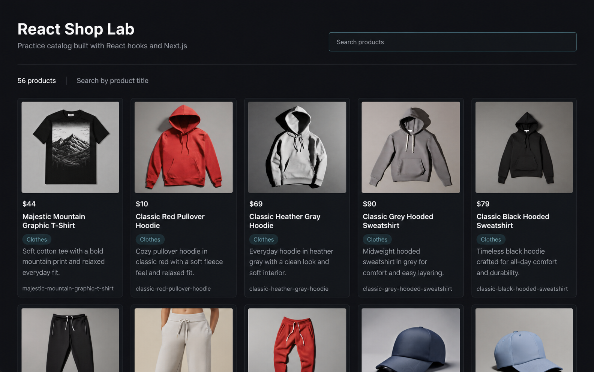
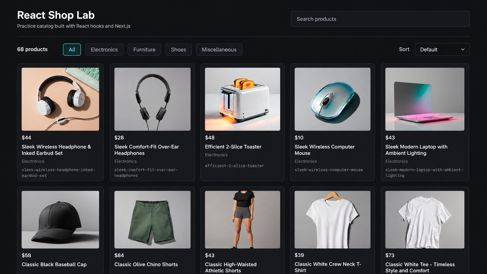

# React Shop Lab

An educational storefront built to practise modern React hooks, TypeScript, and the Next.js App Router. The project includes a searchable product catalog, product pages, a shared cart, favorites, browser persistence, and cross-tab synchronization.

## Screenshots





## Stack

- Next.js 16 App Router
- React 19
- TypeScript
- Tailwind CSS 4
- Platzi Fake Store API
- Vercel

## Features

- Client-side product loading with loading, error, and empty states
- Debounced product search
- Category filtering and price/title sorting
- Responsive product grid
- Dynamic product pages by slug
- Shared cart available through React Context
- Cart actions implemented with `useReducer`
- Cart and favorites persistence in `localStorage`
- Cart and favorites synchronization between browser tabs
- Favorites implemented as an external store
- Optimistic favorite updates with a simulated async confirmation
- Server and Client Component composition
- Abortable requests with `AbortController`

## Routes

- `/` - product catalog
- `/products/[slug]` - product details
- `/cart` - persistent shopping cart

## Hooks Practised

| Hook | Use in the project |
| --- | --- |
| `useState` | Search, category, sorting, loading, errors, and cart restoration status |
| `useEffect` | Product requests, debounce cleanup, autofocus, and `localStorage` synchronization |
| `useRef` | Search input access and stable mutable values inside custom hooks |
| `useMemo` | Derived categories and filtered/sorted products |
| `useReducer` | Cart add, remove, increase, decrease, clear, and hydrate actions |
| `useContext` | Shared cart access through `CartProvider` |
| `useId` | Accessible relationships between labels and controls |
| `useTransition` | Non-urgent category changes and pending UI |
| `useImperativeHandle` | Restricted search input API such as `focus()` and `clear()` |
| `useSyncExternalStore` | Favorites store snapshots, subscriptions, SSR snapshot, and cross-tab updates |
| `useOptimistic` | Immediate favorite feedback before simulated async confirmation |

Additional experiments completed during the roadmap:

- `useCallback` with `React.memo`; both were later removed when their references no longer improved rendering.
- `useDeferredValue` compared with debounce; debounce was retained for the intended search behavior.
- `useLayoutEffect` used for a DOM measurement exercise and removed because the final UI did not require synchronous layout measurement.

## State And Persistence

The cart and favorites intentionally use different state models:

- The cart remains React-owned state managed by `useReducer` and distributed through Context. Effects restore and persist it in `localStorage`.
- Favorites use a small external store connected to React through `useSyncExternalStore`. The store exposes stable snapshots, subscriptions, actions, and a server snapshot.

Both features listen for the browser `storage` event so changes made in one tab appear in another tab on the same origin.

## Architecture

The source tree follows an FSD-inspired separation of responsibilities:

```text
src/
  app/                       routes, layout, and providers
  entities/product/          product model, API, and reusable UI
  features/cart/             cart model, context, and UI
  features/favorites/        external favorites store and favorite action
  features/products-catalog/ catalog state, derived data, and UI
```

Product entities do not import cart or favorites features. Route and feature-level components compose entity UI with feature actions through props and slots.

## Getting Started

Install dependencies:

```bash
npm install
```

Start the development server:

```bash
npm run dev
```

Open [http://localhost:3000](http://localhost:3000).

Useful checks:

```bash
npm run lint
npx tsc --noEmit
npm run build
```

## Deployment

The application is deployed with Vercel. The project does not require environment variables in its current API configuration.

## What I Learned

- How React state, reducers, Context, and external stores solve different ownership problems
- How immutable snapshots allow React to detect external store changes
- How SSR and hydration affect browser-only APIs such as `localStorage`
- How to persist state without replacing the existing cart architecture
- How optimistic UI separates temporary feedback from confirmed state
- How Server and Client Components can be composed without turning an entire route into a Client Component
- How to keep feature actions out of reusable entity components

## Limitations And Next Steps

- The public fake API can be slow, mutable, or return broken image URLs.
- The optimistic favorite request currently uses an artificial delay for learning purposes.
- Cart and favorites are browser-local and are not associated with an authenticated user.
- Automated component and end-to-end tests are not included yet.

The next planned stage is migrating product data and images to an InsForge backend, followed by real server persistence and API-backed optimistic updates.
